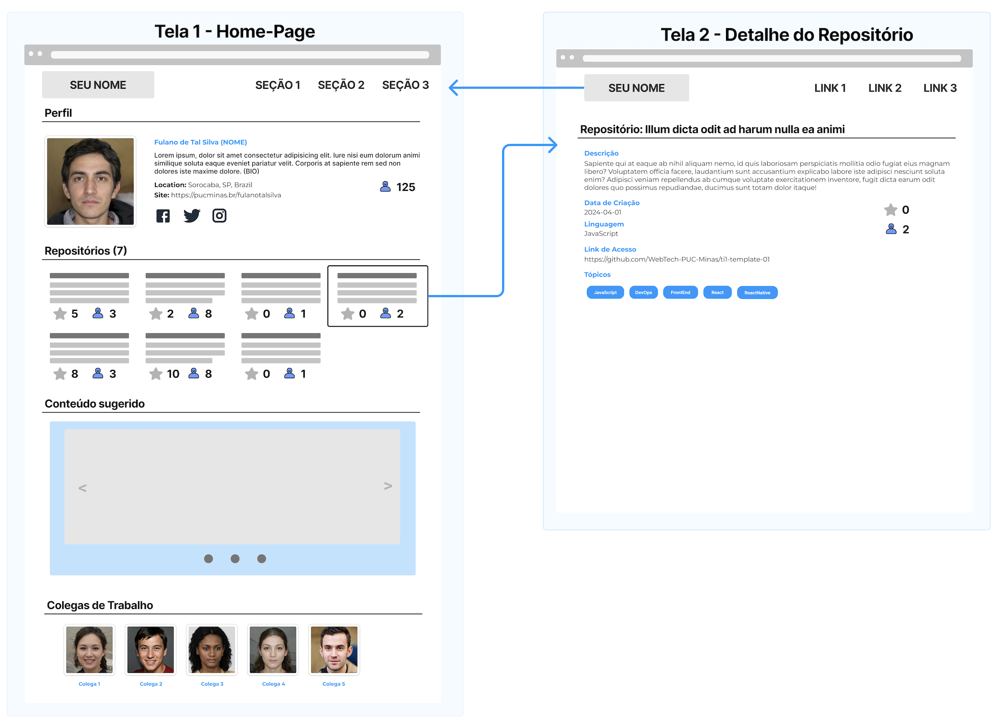

# Personal Website

## Overview
First DIW (Web Interfaces Development) project.

Simple web application with only **HTML**, **CSS**, **Bootstrap**. The focus of this project is on the basics of web development, trying to maintain principles, such as **responsiveness** and **semantic**.

## Wireframe / Userflow
Here's the wireframe and userflow of the project:

